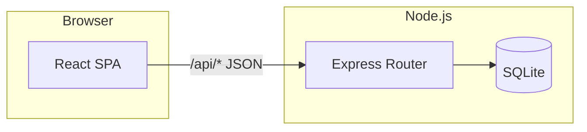

# FLYVIO 系统架构

## 总览

采用经典 **前后端分离** 架构：浏览器中的单页应用（SPA）通过 HTTP JSON 调用 REST API；业务数据持久化在 **SQLite**（文件位于 `server/data/flyvio.db`，测试时使用 `:memory:`）。

## 前端（`client/`）

- **路由**：`react-router-dom`，底部四 Tab（首页 / 机票 / 订单 / 我的）。
- **状态**：用户 ID 存 `localStorage`，请求头携带 `X-User-Id`（演示级身份方案）。
- **样式**：全局 CSS 变量定义米黄背景、蓝/黄组件色与圆角阴影，无额外 UI 框架以降低体积。
- **开发代理**：`vite.config.ts` 将 `/api` 转发到 `http://127.0.0.1:3001`。

## 后端（`server/`）

- **入口**：`src/index.js` 初始化数据库后监听端口；`src/app.js` 导出可测试的 Express 实例。
- **数据访问**：`better-sqlite3` 同步 API，事务用于下单扣库存与写订单。
- **模块划分**：`routes/` 下按领域拆分（航班、订单、用户、优惠券、监控、AI）。

## 数据模型（逻辑）

- **users**：用户与 `preferences_json`（JSON 字符串）。
- **flights**：航班快照 + 价格 + 行李/退改/餐食等展示字段 + `stock`。
- **orders**：`flight_ids_json`、`passengers_json`、金额、状态、`coupon_id`。
- **coupons / user_coupons**：券模板与用户持有关系，`used` 标记。
- **price_monitors**：用户监控航线、日期区间与目标价。

## AI 模块（当前实现）

位于 `server/src/routes/ai.js`，基于现有 `flights` 表做 **启发式与聚合**（最低价、均价对比、低价目的地分组），接口形态固定，便于日后替换为独立 Python/Go 推理服务或调用外部模型 API。

## 扩展建议

- 身份：JWT + Refresh Token，或 OAuth；`X-User-Id` 仅用于原型。
- 搜索：航班数据迁入 PostgreSQL + 全文检索或专用搜索引擎；价格同步用队列增量更新。
- 支付：对接官方 SDK，Webhook 验签后更新订单状态。
- 监控：定时任务扫描 `price_monitors` 与最新报价表，写入提醒队列（短信/推送）。
